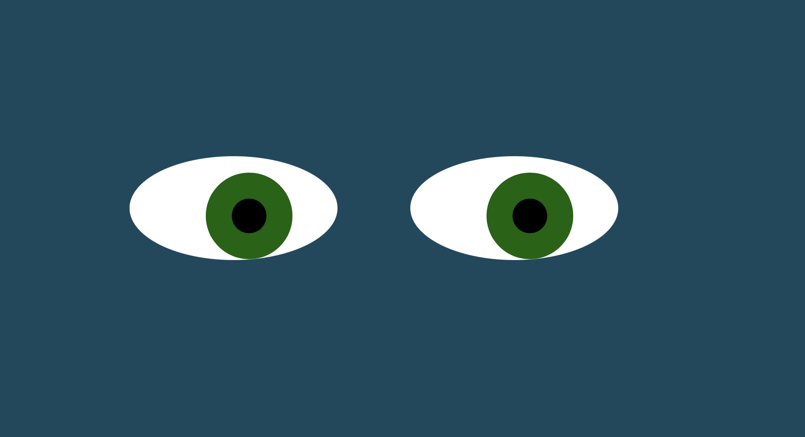

<h1>Eye Movement Project</h1>

<h2>DESCRIPTION</h2>

This assignment was to use basic JavaScript to enable the eyeballs to follow the cursor as the user moves it.

   
<h2>Link to Project</h2>
<a href="https://avorwerk98.github.io/Eyes-Project/"</a>

